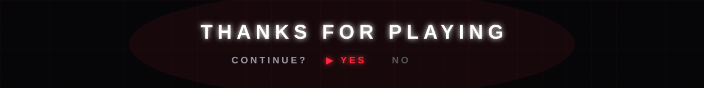

<div align="center">

<!-- ===== CUSTOM ANIMATED HEADER // glitch + HUD grid + press start ===== -->


<!-- ===== TYPING ANIMATION (ORBITRON) ===== -->
<a href="https://shivam-anand-portfolio-03.netlify.app/">
  
</a>

<br/><br/>

<!-- ===== BADGES ===== -->
<p>
  
  &nbsp;
  <a href="https://github.com/Shivam-Anand-03?tab=followers">
    
  </a>
  &nbsp;
  <a href="https://shivam-anand-portfolio-03.netlify.app/">
    
  </a>
  &nbsp;
  <a href="https://www.linkedin.com/in/shivam-anand-developer/">
    
  </a>
  &nbsp;
  <a href="mailto:shivam850anand@gmail.com">
    
  </a>
</p>

</div>


## 🎮 PLAYER PROFILE

```typescript
const player = {
  name         : "Shivam Anand",
  class        : "Full Stack // AI Engineer",
  guild        : "Xoidlabs",
  base         : "Indore, India 🇮🇳",
  education    : "B.E. @ SGSITS Indore",
  mainQuest    : "Building AI powered SaaS platforms that real people use",
  skillTree    : ["Scalable SaaS", "GenAI / RAG", "Backend Architecture"],
  contact      : "shivam850anand@gmail.com",
  achievement  : "Shipped 3 AI platforms before graduating ⚡",
};
```

- 🎯 **MAIN QUEST:** building AI platforms (HPLC AI, Upgence, Trugent) at **Xoidlabs**
- 🌱 **XP FARMING:** LangChain, LLM tool calling, vector databases and semantic search
- ⚔️ **WEAPONS OF CHOICE:** Next.js, TypeScript, Node.js, FastAPI, PostgreSQL, Redis
- 🕹️ **200+ LeetCode problems cleared** and counting


## ⚔️ QUEST LOG

<table>
<tr>
<td width="50%" valign="top">

### 🔴 MAIN QUEST // Xoidlabs
**AI & Full Stack Developer** · `Jul 2025 to Present`
- Built **3 AI platforms** (HPLC AI, Upgence, Trugent) on production ready architecture
- Engineered a **RAG pipeline over 15,000+ documents** with Pinecone and semantic caching, boosting retrieval efficiency ~95%
- Created **Upgence**, an AI freelancer marketplace with WebRTC AI interviews and LLM tool calling
- Deployed on **GCP** with Docker, Nginx, PM2 and CI/CD
- Led a **50 person data annotation team**

**Stack:** `Next.js` `FastAPI` `LangChain` `Pinecone` `PostgreSQL` `Redis` `Docker` `GCP`

</td>
<td width="50%" valign="top">

### 🔴 SIDE QUEST // Flexzistay
**Software Developer Intern** · `Dec 2025 to Feb 2026`
- Cut Google Places API costs by **40%+** with Redis caching and background jobs on GCP Pub/Sub
- Sped up the Next.js frontend with infinite scrolling, lazy loading and tuned PostgreSQL queries

**Stack:** `TypeScript` `Next.js` `PostgreSQL` `Redis` `GCP Pub/Sub`

</td>
</tr>
<tr>
<td width="50%" valign="top">

### 🔴 SIDE QUEST // Upfound
**Backend Developer Intern** · `May 2025 to Jul 2025`
- Built the backend of a social media management platform on the **MERN stack**
- Secure REST APIs with **JWT auth** and role based access control via Auth0
- Integrated **AWS S3, Cloudinary and Firebase** with live updates over WebSockets

**Stack:** `Node.js` `Express` `MongoDB` `Redis` `WebSockets`

</td>
<td width="50%" valign="top">

### ⚡ ENDLESS MODE // Always Building
- Open source components and UI libraries
- AI integrated developer tools
- SaaS experiments and side projects
- Exploring LangGraph, agents and vector DBs

**Mindset:** `Ship fast` `Scale smart` `Stay curious`

</td>
</tr>
</table>


## 🚀 LEGENDARY BUILDS

<div align="center">

| Build | Description | Tech |
|:------|:------------|:-----|
| 📧 **[Miraj AI Mailer](https://www.loom.com/share/902f7cf38fe143558f7f38e26da46866)** | AI powered bulk email SaaS with smart personalization, open rate optimization and one unified inbox across accounts | `Next.js` `tRPC` `Convex` `OpenAI` `Redis` |
| ⚖️ **[LawCrew](https://www.youtube.com/watch?v=QDZgMRAH-qg)** | Legal practice SaaS with 4 role RBAC and AI that drafts legal documents and case analysis, cutting review time 70%+ | `Next.js` `Prisma` `MySQL` `Gemini` `GraphQL` |
| 🎨 **[Clamp UI](https://code-clamp.vercel.app/)** | Developer first component library. Accessible, themeable and ready to drop into production | `React` `TypeScript` `Tailwind` |

</div>


## 🛠️ SKILL TREE

<div align="center">

### Languages


### Frontend


### Backend


### Databases & Caching


### AI / ML


### Cloud & DevOps


<br/>


</div>


## 📊 PLAYER STATS

<div align="center">
  
  &nbsp;
  
</div>

<div align="center">
  
</div>

<!-- Contribution snake (dark). Needs the snake workflow, see setup below. -->
<div align="center">
  
</div>

<div align="center">
  
</div>

<details>
<summary>🐍 Snake setup (one time)</summary>

Create `.github/workflows/snake.yml` in this repo with:

```yaml
name: generate snake
on:
  schedule:
    - cron: "0 0 * * *"
  workflow_dispatch:
jobs:
  build:
    runs-on: ubuntu-latest
    permissions:
      contents: write
    steps:
      - uses: Platane/snk@v3
        with:
          github_user_name: Shivam-Anand-03
          outputs: |
            dist/github-contribution-grid-snake-dark.svg?palette=github-dark
      - uses: crazy-max/ghaction-github-pages@v4
        with:
          target_branch: output
          build_dir: dist
        env:
          GITHUB_TOKEN: ${{ secrets.GITHUB_TOKEN }}
```

Then run it once from the Actions tab.

</details>


## 🏆 ACHIEVEMENTS UNLOCKED

<div align="center">
  
</div>

- 🥇 **Finalist** at Bit and Build Hackathon 2024 (GDSC FCRCE, Mumbai)
- 🧠 **200+ LeetCode problems** solved
- 🤖 **3 AI platforms shipped** to production while still in college


## 📫 CO-OP MODE

<div align="center">

<a href="https://shivam-anand-portfolio-03.netlify.app/">
  
</a>
&nbsp;
<a href="https://www.linkedin.com/in/shivam-anand-developer/">
  
</a>
&nbsp;
<a href="mailto:shivam850anand@gmail.com">
  
</a>
&nbsp;
<a href="https://leetcode.com/u/Shivam-Anand-03/">
  
</a>

<br/><br/>

> *"From mechanical blueprints to software architecture. Building systems that scale."* ⚙️ → 🚀

</div>

<!-- ===== CUSTOM ANIMATED FOOTER // game over screen ===== -->


